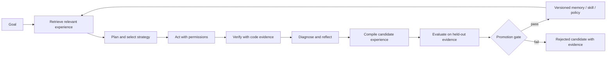
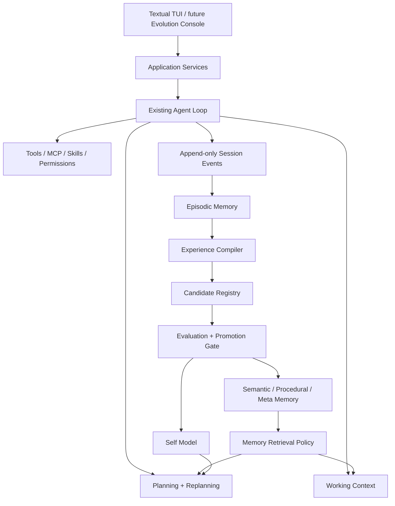

# Bauhinia-Agent Evo 产品需求文档（PRD）

> 文档状态：Draft v1.0
> 产品阶段：二次开发正式立项
> 适用仓库：Bauhinia-Agent
> 文档属性：项目事实源，纳入版本控制
> 生效日期：2026-07-31
> 取代关系：本文件取代 `PRODUCT.md` 作为当前产品事实源；旧文件仅作历史参考

## 1. 产品定义

### 1.1 名称与定位

**Bauhinia-Agent Evo**

副标题：**Experience-Compiling Self-Improving Coding Agent**

一句话定位：

> 一个从经过验证的软件开发经历中持续学习，能够改进自身规划、上下文选择、工具策略与工程 Skills 的本地优先 Coding Agent。

Bauhinia-Agent Evo 的核心不是“拥有更多记忆”，也不是让 Agent 不受约束地重写自己。它将每次真实开发任务的计划、行动、验证、失败和结果转化为可追溯、可评测、可回滚的工程经验；只有被独立验证的经验才能改变未来任务的行为。

### 1.2 产品承诺

每完成一次经过验证的开发任务，Bauhinia-Agent Evo 应至少在以下一个维度留下可验证的改进：

- 更准确地规划相似任务。
- 更快地找到正确代码和上下文。
- 更少重复已知失败的工具调用或操作路径。
- 更可靠地选择、组合或改进已有 Skills。
- 更清楚地知道自身能力边界与何时应请求确认。

### 1.3 产品边界

Bauhinia-Agent Evo 是一个 **Self-Improving Coding Agent**，不是：

- 仅存储对话文本的通用长期记忆产品。
- 仅展示调用链的可观测平台。
- 无限制自动改写系统 Prompt、权限策略或核心 Agent 代码的自治系统。
- 以模型权重训练、强化学习基础设施为首要目标的训练平台。
- 通用个人助理、渠道机器人或 Deep Research Agent。
- 与 Codex、Claude Code、Cline 在基础代码生成能力上正面竞争的替代品。

## 2. 背景、问题与机会

### 2.1 目标问题

今天的 Coding Agent 通常能完成单次任务，但跨任务成长仍不稳定：

- 相似任务会反复搜索同样的文件、犯同样的工具错误。
- 计划往往是静态清单，遇到新证据、失败或权限拒绝后不能结构化重规划。
- 上下文压缩会使已验证事实、失败原因或用户决策丢失。
- “反思”经常只是文本自评，缺少真实测试和保留集验证。
- 记忆可能过期、冲突、跨项目污染，甚至将错误推断升级为规则。
- 一次成功并不说明某个 Skill、Prompt 或策略可以在未来安全复用。
- Agent 通常不知道自己在特定语言、仓库、工具或环境上的可靠性边界。

### 2.2 机会

自进化 Agent 已出现三条重要路线：可组合的长期 Skill 库、从经验中提取 Insight、以及通过反馈修订上下文或策略。Bauhinia-Agent Evo 的机会在于将这些路线落到真实软件工程中，并使用 Git、测试、Lint、类型检查、权限与工作区状态作为主要反馈，而不是只依赖模型自评。

### 2.3 现有基础

现有 Bauhinia-Agent 已拥有 Evo 的关键基础：

- `agent/`：可扩展的 Agent Loop、会话和子 Agent。
- `planning/`：计划相关基础能力。
- `context/`：事实、投影、Token 预算与 L1–L4 压缩。
- `session/`：本地会话、恢复、分叉和生命周期。
- `tools/`、`mcp/`、`skills/`：可行动能力与能力扩展面。
- `permissions/`：写入、Shell、Git 和外部调用的真实代码层约束。
- `runtime/`：进程、工作区和运行时能力。
- Textual TUI、命令系统、Provider 抽象和测试体系。

二次开发必须扩展这些边界，而不是构建第二个 Agent Loop、第二个上下文系统、第二个 Tool Registry 或绕开现有权限系统。

## 3. 目标用户与任务

### 3.1 核心用户

**长期维护代码库的独立开发者**：希望 Agent 逐步理解项目习惯、架构决策和测试方式，而不是每个会话从零开始。

**AI 工程师与 Agent 开发者**：希望量化一个 Agent 是否真正随经验改善，并能定位是规划、记忆、工具还是模型导致退化。

**维护复杂工程的技术负责人**：希望 Agent 将经过验证的工程经验沉淀为团队可审计资产，而非散落于聊天记录中。

### 3.2 核心 Jobs To Be Done

| 用户情境 | 用户希望完成的任务 | Evo 的结果 |
| --- | --- | --- |
| 再次处理同类缺陷 | 不重复过去的无效探索 | 命中已验证 Plan Template、Skill 或 Anti-pattern |
| 任务途中出现意外 | 根据证据调整计划 | 记录重规划原因、替代方案和验证结果 |
| 跨会话继续工作 | 恢复正确的项目知识 | 检索带来源、范围、置信度和时效的记忆 |
| 多次成功完成工作 | 将经验变成能力 | 生成并验证可版本化的 Procedural Skill |
| Agent 表现变差 | 防止错误经验污染未来任务 | 候选经验隔离、保留集评测、回滚与失效 |
| 选择是否放手给 Agent | 知道其可信边界 | Self Model 提供能力画像与风险提示 |

## 4. 产品原则

1. **验证先于晋升**：自我反思只产生候选经验；测试、证据和保留集决定是否晋升。
2. **经验可追溯**：每条长期记忆、Skill 与策略变更都必须能回到原始任务与证据。
3. **计划是可演化图，不是一次性文本**：计划应表达目标、依赖、假设、验收和重规划路径。
4. **短期适应与长期学习分离**：任务内修正不能直接污染跨任务知识。
5. **模型私有推理不作为事实源**：记录可验证的决策摘要、证据和行动理由，不要求存储完整思维链。
6. **代码状态优先**：当记忆与当前代码、测试或用户指令冲突时，优先相信可验证的当前事实。
7. **最小权限不随学习扩大**：经验和 Skill 不能自行提升工具权限、网络范围或副作用等级。
8. **本地优先、版本可回滚**：项目经验默认本地保存，每次演化可比较、禁用与回退。
9. **改善必须可测量**：成功率、复发错误率、成本、耗时和安全性都属于改善的一部分。

## 5. 产品核心闭环



该闭环有两个时钟：

| 循环 | 时间尺度 | 目的 |
| --- | --- | --- |
| Fast Loop | 单次模型调用到单次任务 | 观察、计划、行动、验证、修正与重规划 |
| Slow Loop | 任务结束到多次任务后 | 汇总经验、生成候选能力、评测、晋升、衰减与回滚 |

## 6. 功能需求

### 6.1 FR-PLAN：层次规划与动态重规划

系统必须：

- 将复杂目标拆解为带依赖关系的 Plan Graph，而不仅是平铺任务列表。
- 在每个节点保存目标、前置条件、假设、工具预算、风险、验收条件和状态。
- 将当前计划与实际执行事件关联，明确哪些节点被跳过、失败、修复、取消或替换。
- 支持在新证据、测试失败、权限拒绝、预算压力、记忆冲突和子 Agent 分歧时触发 Replan。
- 在重规划前记录触发证据、候选方案和选择理由摘要。
- 支持从成功计划中提取 Plan Template，从失败计划中提取 Anti-pattern。
- 支持 Planner、Executor、Verifier、Critic、Curator 等角色，但不得强制所有任务都创建多 Agent。

### 6.2 FR-REASON：可审计多步决策

系统必须为关键决策记录结构化 Decision Record：

```text
subgoal
evidence_refs
assumptions
options_considered
selected_action
rationale_summary
confidence
expected_observation
verification_method
outcome
next_decision
```

系统必须：

- 区分模型输出、工具观察、用户确认、推断和已验证事实。
- 不将未验证推断自动写入长期记忆。
- 允许 Provider 提供的 reasoning 摘要作为诊断附件，但不得把完整私有思维链设为产品依赖。
- 对高风险行动要求可观察的验证计划，而非仅依赖自然语言自信度。

### 6.3 FR-MEM：五层记忆与 Meta-Memory

| 层级 | 作用域与寿命 | 内容 | 真相来源 |
| --- | --- | --- | --- |
| Working | 当前调用 | 当前上下文、观察、假设、临时草稿 | Context Projection |
| Task | 当前任务/分支 | Plan、决策、进度、临时发现 | Session + Plan Graph |
| Episodic | 跨会话 | 完整任务轨迹、结果、失败模式、Patch 摘要 | Append-only Events |
| Semantic | 项目/用户长期 | 已验证事实、架构、惯例、约束 | Evidence-linked Memory |
| Procedural | 长期、版本化 | Plan Template、Skill、工具策略、Anti-pattern | Promotion Registry |

Meta-Memory 必须保存检索、晋升、衰减和冲突解决策略，包括：来源、作用域、置信度、访问次数、成功贡献、过期规则、替代关系和失效条件。

### 6.4 FR-RETRIEVE：上下文与经验检索

系统必须：

- 根据任务类型、仓库、分支、语言、文件、工具、失败模式和用户目标检索候选经验。
- 对每个命中展示来源、范围、置信度、时效、适用条件和预计 Token 成本。
- 使用预算感知的装配策略，避免把全部长期记忆塞入上下文。
- 在记忆与当前代码或用户指令冲突时显示冲突，并降低旧记忆权重。
- 支持项目、用户、分支、任务和会话的隔离范围，防止跨项目污染。
- 记录“使用了什么经验、是否有帮助、是否导致失败”，为 Meta-Memory 提供反馈。

### 6.5 FR-VERIFY：工程验证与失败归因

系统必须：

- 将测试、Lint、类型检查、构建、Diff、退出码、权限结果和用户确认作为一等反馈信号。
- 区分任务失败、验证失败、环境失败、权限拒绝、工具失败和评测失败。
- 将失败定位到计划、上下文、模型、工具、权限、环境或记忆的至少一个可解释类别。
- 支持确定性验证优先，LLM-as-Judge 只能作为补充信号。
- 记录验证器版本、输入、输出、执行环境和证据引用。

### 6.6 FR-EXPC：Experience Compiler

Experience Compiler 必须将原始轨迹转换为候选经验：

```text
Raw Trajectory
  -> Outcome Classification
  -> Failure / Success Attribution
  -> Evidence Extraction
  -> Candidate Memory, Skill, Plan Template or Anti-pattern
  -> Scope, Confidence and Invalidation Rules
```

它必须：

- 只从有结果与证据的轨迹生成候选项。
- 生成 Semantic Memory、Procedural Skill、Plan Template 与 Anti-pattern 四类候选产物。
- 为候选项保留原始 Run、相关文件、测试、环境、模型、工具和版本引用。
- 去重、聚合相似候选并保留相互矛盾的证据。
- 把一次性技巧标记为低置信度，禁止自动升级为全局规则。

### 6.7 FR-EVOLVE：Skill 与策略进化

系统必须：

- 从重复成功轨迹创建 Skill Candidate，而不是从单次自然语言反思直接创建生产 Skill。
- 为 Skill 声明输入、输出、依赖、适用范围、权限、Effect、示例、测试和版本。
- 允许演化以下受控对象：Skill 内容、Plan Template、检索排序策略、上下文装配策略和角色选择策略。
- 不允许第一阶段自动修改模型权重、核心 Agent Loop、系统安全策略、权限策略或远程生产配置。
- 支持候选版本与已晋升版本的 A/B 或保留集比较。

### 6.8 FR-PROMOTE：晋升、回滚与衰减

所有可影响未来行为的长期产物遵循状态机：

```text
Candidate -> Shadow -> Validated -> Promoted -> Deprecated
                 \-> Rejected
```

| 状态 | 行为 |
| --- | --- |
| Candidate | 已产生，但不参与执行决策 |
| Shadow | 可生成建议并收集影子评估，不改变执行 |
| Validated | 通过明确测试和保留集，可由用户选择启用 |
| Promoted | 默认可参与匹配范围内的规划和检索 |
| Deprecated | 过期、冲突或回归后不再默认使用 |
| Rejected | 未通过评测，保留失败证据但不参与执行 |

晋升至少需要：可追溯来源、明确适用范围、独立验证、无关键安全回归、可回滚版本和可解释指标。一次成功或模型自评不得单独构成晋升条件。

### 6.9 FR-SELF：Self Model

系统必须维护可查询的能力画像：

- 按项目、语言、任务类别、工具、模型和环境统计成功率、成本、耗时与失败类型。
- 记录可信度与样本量，避免从少数任务得出确定结论。
- 在计划阶段提示风险，例如“当前项目中的数据库迁移经验样本不足”。
- 支持将高失败率领域自动降级为更严格验证或请求用户确认。
- Self Model 是建议与安全控制输入，不得直接扩展权限。

### 6.10 FR-SUB：子 Agent 协作

系统应支持角色化协作：

- Planner：分析目标、建立 Plan Graph。
- Researcher：只读收集代码与外部证据。
- Executor：实施受权限约束的行动。
- Verifier：运行确定性检查并产出证据。
- Critic：审查计划与结果，提出候选修正。
- Curator：在 Slow Loop 中编译与整理经验。

每个子 Agent 必须具备独立任务范围、上下文边界、权限边界和结果摘要。主 Agent 只能接收被标记来源和置信度的摘要，不能把子 Agent 推断自动当成事实。

### 6.11 FR-UI：TUI 与 Evolution Console

首版以现有 Textual TUI 为主，必须展示：

- 当前 Plan Graph 与节点状态。
- 当前命中的记忆、其来源和适用范围。
- Replan 原因及前后计划差异。
- 本次任务的新经验、候选状态与拒绝原因。
- Self Model 风险提示。

Web GUI 是后续 Evolution Console，优先用于历史 Run、记忆谱系、Skill 版本、评测比较和能力画像；不得成为核心执行逻辑的依赖。

## 7. 数据模型

### 7.1 核心实体

| 实体 | 职责 |
| --- | --- |
| Run | 一次 Agent 任务运行 |
| PlanGraph / PlanNode | 目标、依赖、假设、状态与验收 |
| DecisionRecord | 可审计的决策摘要与证据 |
| Evidence | 代码、测试、工具、用户或环境证据引用 |
| MemoryItem | 语义、情节、任务或元记忆项 |
| ExperienceCandidate | 原始轨迹编译出的候选经验 |
| SkillVersion | 版本化 Procedural Memory |
| EvaluationRun | 候选项在验证集或影子流量上的结果 |
| PromotionRecord | 状态变化、审批、指标和回滚关系 |
| SelfModelProfile | 能力画像与不确定性 |

### 7.2 持久化规则

- 原始事件与轨迹为 append-only 事实源。
- Memory、索引、统计和 UI 状态是派生投影，必须可重建。
- 每个持久化对象必须携带 `schema_version`、ID、来源、时间、范围与关联 Run。
- 对象修改使用新版本或追加更正事件，禁止就地篡改历史事实。
- 默认存储于项目 `.bauhinia-agent/`；项目级数据不得默认跨项目共享。

### 7.3 Candidate 最低字段

```text
candidate_id
kind
schema_version
source_run_ids
evidence_refs
scope
applicability
confidence
effects_and_permissions
created_at
invalidation_rules
evaluation_history
lifecycle_state
supersedes / superseded_by
```

## 8. 架构方向



推荐新增模块：

- `bauhinia_agent/memory/`：长期 Memory、作用域、检索、冲突与衰减。
- `bauhinia_agent/evolution/`：Experience Compiler、Candidate Registry、晋升与回滚。
- `bauhinia_agent/evaluation/`：保留集、验证器、比较和指标。
- 在 `bauhinia_agent/planning/` 中扩展 Plan Graph、Replan Policy 与模板。
- 在 `bauhinia_agent/context/` 中保持 Working Memory、预算和压缩职责。

## 9. MVP

### 9.1 MVP 闭环

MVP 必须完成以下端到端流程：

1. 用户提交一个真实代码任务。
2. Agent 检索项目级已验证经验，生成带验收条件的 Plan Graph。
3. Agent 在工具和权限约束下执行，并在失败时产生 Replan。
4. 测试或确定性验证产出结构化证据。
5. 任务结束后，Experience Compiler 生成候选经验。
6. 候选经验进入 Shadow 或 Evaluator，而非直接写入长期规则。
7. 使用独立历史任务或测试验证候选项。
8. 通过的候选项晋升为项目级 Memory 或 Skill Version。
9. 后续相似任务命中该经验，并记录它是否真实改善结果。
10. 用户可在 TUI 查看计划、经验来源、进化状态和回滚入口。

### 9.2 MVP 范围内

- 层次 Plan Graph 与受控 Replan。
- Task、Episodic、Semantic、Procedural、Meta 五类记忆的最小实现。
- 基于测试/命令/文件 Diff 的证据化验证。
- Experience Candidate 和五级生命周期。
- Plan Template、Anti-pattern 与 Skill Candidate。
- 保留集验证、版本比较和回滚。
- Self Model 的基础统计与风险提示。
- TUI Evolution View。

### 9.3 MVP 非目标

- 在线强化学习、模型微调或模型权重修改。
- 自动修改核心 Agent Loop 或安全策略。
- 未经审批的生产部署、外部服务写入或权限扩大。
- 全功能 Web GUI、团队账户、云端同步和能力市场。
- 跨 Agent 可移植经验格式的完整标准化。
- 用单一“智能分数”描述 Agent 改善。

## 10. 成功指标与验收

### 10.1 北极星指标

**Verified Improvement Rate（VIR）**：在独立、相似任务保留集上，启用已晋升经验后相对于基线获得改善，且无安全/质量回归的比例。

### 10.2 核心指标

- 相似任务的重复失败动作减少率。
- 计划完成率与 Replan 后恢复率。
- 已晋升经验的真实命中率、帮助率和误导率。
- Candidate 到 Validated 的通过率与回滚率。
- 任务成功率、测试通过率、总耗时、Token 与工具调用数的变化。
- 高风险操作在验证前被阻止或降级的比例。
- 跨项目记忆污染事件数，目标为 0。

### 10.3 MVP 验收场景

1. Agent 第一次修复某类 Provider 接入问题并通过测试，形成候选 Plan Template。
2. 在独立但相似的问题上，该 Template 进入 Shadow 对比，显示帮助或无帮助证据。
3. 同一失败工具调用发生后，Agent 检索 Anti-pattern 并不重复相同操作。
4. 代码证据推翻旧记忆时，系统显示冲突并降低旧记忆权重。
5. 任务中测试失败后，Plan Graph 产生新的替代节点并记录 Replan 原因。
6. Skill Candidate 未通过保留集时被 Rejected，且不会影响后续默认行为。
7. 已晋升 Skill 出现回归时可回滚到前一版本。
8. TUI 能显示本次决策使用的记忆和所有新经验的生命周期。

## 11. 风险与缓解

| 风险 | 缓解 |
| --- | --- |
| 错误经验被长期固化 | Candidate/Shadow/Validated 门禁、保留集、版本回滚、失效规则 |
| 模型自评导致奖励投机 | 确定性验证优先，评测器独立，保留原始证据 |
| 记忆过多污染上下文 | 作用域隔离、预算感知检索、衰减、冲突检测与 Meta-Memory |
| 自我进化扩大副作用 | 权限系统不可被经验绕过；未知 Effect 视为高风险 |
| 演化过程成本失控 | 最大迭代数、候选预算、离线批处理、影子评估配额 |
| 把一次成功误当通用规律 | 样本量、适用条件、置信度与多任务验证要求 |
| 自改核心代码破坏稳定性 | MVP 禁止自动改写核心 Loop；后续也必须走隔离分支和人工审批 |

## 12. 版本路线

### R0：可测基线

固定任务集、基线 Agent 行为、现有会话与测试健康度。

### R1：会规划、会重规划

Plan Graph、Decision Record、验证驱动 Replan。

### R2：会记住正确经验

分层记忆、检索、作用域、来源、冲突和衰减。

### R3：会从经历中抽取候选能力

Experience Compiler、Plan Template、Anti-pattern、Skill Candidate。

### R4：会证明自己真的变好

Evaluation、Promotion、Rollback、Self Model 和对照实验。

### R5：Evolution Console

强化 TUI，必要时增加本地 GUI 用于经验谱系、版本比较和长期趋势。

## 13. 完成定义

Bauhinia-Agent Evo 的一个“自我改进”功能只有满足以下条件才能声称完成：

- 有明确的进化对象、输入、输出、作用域与失败模式。
- 不依赖暴露或持久化完整模型私有推理。
- 原始证据、候选项、评测和晋升记录全部可追溯。
- 默认不会扩大权限、触发额外真实副作用或修改核心安全策略。
- 正常、失败、取消、拒绝、冲突与回滚路径均有测试。
- 改善通过独立任务、保留集或明确对照验证，而非仅凭单次示例。
- 相关数据有 Schema 版本、迁移与本地隐私保护策略。
- TUI 或可复现命令能让用户理解“它学到了什么、为什么可信、如何撤销”。
